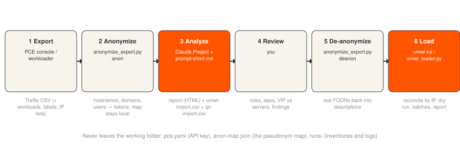
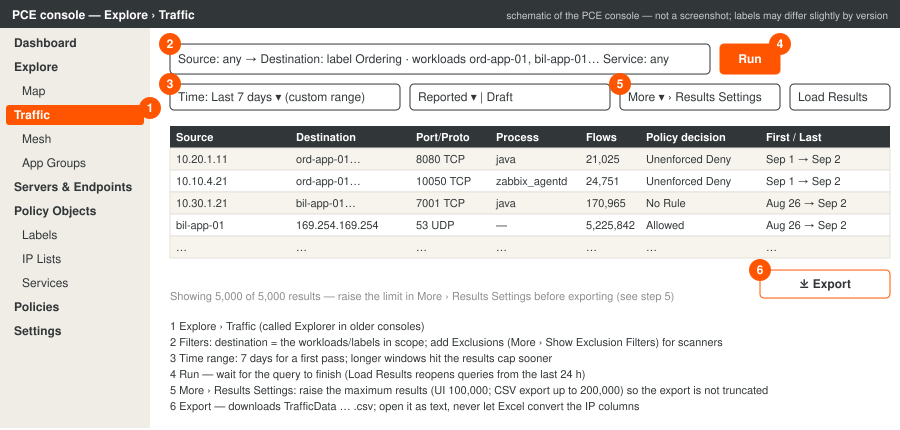
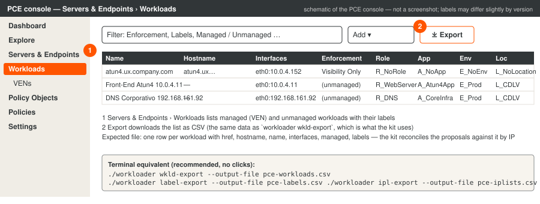
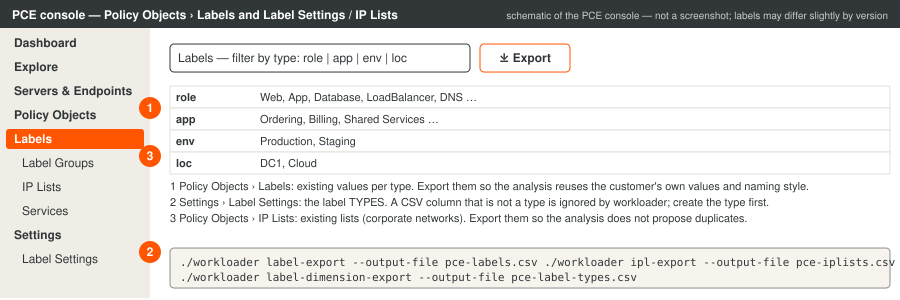

# Usage guide — from an Illumio flow export to loaded policy objects

This guide describes the intended end-to-end use of the kit: exporting the right data from the PCE, anonymizing it,
running the analysis with an AI assistant (a Claude Project), reviewing what comes back, restoring the real names and
loading the objects with `umwl-tui`. It is self-contained: it does not depend on any report template or private skill.
The console pictures are **schematics** (they show where the controls are and what to expect; exact labels vary
slightly between console versions — the steps quote the official documentation for Illumio Core 23.5–25.x).



## 1. What the kit assumes

- One **working folder per Illumio account (organization) + PCE**. workloader reads `./pce.yaml` from the current
  directory; the kit writes `runs/<timestamp>/` there. Mixing two tenants in one folder is how objects end up in the
  wrong PCE. See README → "Initializing the working folder".
- The analysis produces **proposals**; a human reviews them (roles, application ownership, VIP vs. servers) before
  anything is loaded. The loader never writes to the PCE before an explicit confirmation after a dry run.
- Private IPs are the join key between the export, the proposals and the PCE inventory. They are never anonymized;
  everything else that identifies the customer can be.

## 2. Exporting from the PCE

Three kinds of data feed the analysis. The traffic export is mandatory; the other exports make the proposals reuse
the customer's existing nomenclature and avoid duplicates.

### 2.1 Traffic (Explorer) export — mandatory



1. In the left navigation open **Explore › Traffic** (older consoles: **Explorer**; the table is also called *Table
   view*). *Expected:* the filter bar (Source / Destination / Service), the time selector and an empty results table.
2. **Filters.** Put the workloads in scope as *Destination* and again as *Source* in a second query, or simply filter
   by their labels (e.g. the `A_` label of the POC group) and leave the other side open. Do not filter by port. Add
   exclusions (**More › Show Exclusion Filters**) for known vulnerability scanners once you have identified them: a
   single scan can consume the whole results budget.
3. **Time range.** Seven days is the right first pass (one full weekly cycle: backups, batch jobs, patching). Longer
   windows hit the results cap sooner; run a second, longer query for low-frequency flows if needed.
4. **Run.** Wait for the query to complete. *Expected:* the table fills and the footer shows "N of M results". Queries
   from the last 24 hours reappear under **Load Results** without re-running.
5. **More › Results Settings.** Raise the maximum results before exporting. The console shows up to 100,000 rows and
   exports up to 200,000; the default of a saved query can be as low as 5,000. If the export has exactly the cap
   number of rows, it is truncated — the analysis will tell you what consumed it and which filter to add.
6. **Export.** The **Export** button downloads a CSV (`TrafficData <date>.csv`). *Expected columns:* Source/Destination
   IP, IPList, Name, Hostname, Enforcement, one column per label type (Application, Environment, Location, Role and
   any custom type), FQDN, Consuming Process/Service/Username, Transmission, Port, Protocol, Process, Service,
   Username, Num Flows, Bytes In/Out, Connection State, Reported Policy Decision, Reported by, First/Last Detected.

Checks on the file before anything else:

- Open it as text (any editor). **Never open it in Excel and save**: Excel strips the dots of IP addresses that look
  like numbers (`10.0.4.152` → `100415`) and rewrites dates. If someone already did, keep the file anyway: the
  analysis knows how to reconstruct the IPs deterministically, but say so in the prompt.
- Row count vs. the cap (step 5). Date format (the export mixes `MM/DD/YYYY HH:MM` and, in some versions,
  `YYYY-DD-MM`; the analysis handles both, but note the window you expect).
- The `Reported by` column tells which side had the VEN; the `Enforcement` columns tell which IPs are workloads.

Alternative without the console: `workloader traffic --start <date> --end <date> --max-results 200000 --output-file
TrafficData.csv` (flags per `workloader traffic --help`), or the REST API `POST /api/v2/orgs/<org>/traffic_flows/async_queries`.

### 2.2 Workloads, labels and label types — recommended



From the working folder, once `pce.yaml` exists (`./umwl-tui --setup-only` creates it with an API key):

```bash
./workloader wkld-export --output-file pce-workloads.csv           # every workload: href, hostname, name, managed, interfaces, labels
./workloader label-export --output-file pce-labels.csv             # existing label values per type
./workloader label-dimension-export --output-file pce-label-types.csv   # the label TYPES (role, app, env, loc, custom)
```

Console equivalents: **Servers & Endpoints › Workloads › Export** (CSV), **Policy Objects › Labels** (filter by type,
Export) and **Settings › Label Settings** for the types. *Expected:* `pce-workloads.csv` with one row per workload;
`pce-labels.csv` with `href,key,value`; `pce-label-types.csv` with one row per type. A CSV column in the proposals that
is not a type here is silently ignored by workloader — create the type first (`workloader label-dimension-import`).

### 2.3 IP lists — optional



`./workloader ipl-export --output-file pce-iplists.csv` (or **Policy Objects › IP Lists › Export**). Attach it so the
analysis references existing lists (corporate networks, DNS, NTP) in the proposed rules instead of creating duplicates.

### 2.4 Screenshots of the nomenclature — optional but useful

Two or three screenshots of existing unmanaged workloads and labels in the console (name pattern, label prefixes,
interface format) let the assistant copy the customer's conventions exactly. The kit's default convention is
`R_/A_/E_/L_` prefixes, workload name `"<descriptive role> <IP>"`, empty hostname, interface `eth0:<ip>`.

## 3. Anonymization

### 3.1 What leaves the working folder and what must not

The AI assistant needs: private IPs (exact), ports, protocols, processes, service-account usernames (`root`, `oracle`,
`zabbix`… they are role evidence), flow counts, dates, label values, and the shape of hostnames (which host is which,
which tier a domain suggests). It does **not** need: the customer's name, real hostnames/FQDNs, personal usernames,
public IPs of the customer, or anything from `pce.yaml`.

Never upload: `pce.yaml` (API key), `anon-map.json` (the pseudonym map), `runs/` (inventories with real names), API
keys or session tokens pasted from a terminal.

### 3.2 The tool: `anonymize_export.py`

Consistent and reversible pseudonymization, standard library only:

```bash
# before the analysis — same input always maps to the same token; the map is created/updated in anon-map.json
python3 kit/anonymize_export.py anon "TrafficData 9_2_2026.csv" -o traffic.anon.csv --map anon-map.json \
    --customer "Acme S.A." --customer acme --domain acme.com --domain acme.local --public-ips
python3 kit/anonymize_export.py anon pce-workloads.csv -o pce-workloads.anon.csv --map anon-map.json --domain acme.com

# after the analysis — restore real names inside the proposed CSVs (descriptions, FQDNs) before loading
python3 kit/anonymize_export.py deanon C4-umwl-import.csv -o C4-umwl-import.real.csv --map anon-map.json
```

What it does: hostnames/FQDNs in the Name/Hostname/FQDN columns → `host-0001.company.com`, keeping the domain depth
(`unix.corp.acme.com` → `unix.dept.company.com`) so tiers remain recognizable; the customer's name → `Cliente`
everywhere; personal usernames → `user-01`… (well-known service accounts are kept); with `--public-ips`, the
customer's public addresses → `203.0.113.x` / `198.51.100.x` test ranges. Private IPs, ports, processes, labels,
counts and dates are untouched. The map file is written with mode 600 and is in `.gitignore`.

Always pass `--domain` with the customer's domains: third-party FQDNs (`*.trendmicro.com`, `*.oraclecloud.com`,
`*.googleusercontent.com`) then stay visible, and they are evidence (EDR consoles, cloud metadata, SaaS).

The tool ends with a leak check (real domains, customer name or real short hostnames still present in the output) and
prints a warning if it finds any. Read the warning; if a hostname is also used as a label value or inside a
description, add it with `--customer` so it is replaced everywhere.

### 3.3 What anonymization changes in the analysis

- Roles must come from ports/processes/users, never from names: the assistant is instructed accordingly (`context.md`
  §0). This is also why the workload names in the proposals are "role + IP".
- The `description` of every proposed workload carries the pseudonymized FQDN ("FQDN en export (puede estar
  anonimizado): host-0012.dept.company.com"). `deanon` restores it before loading, so the PCE object shows the real
  name in its description while the report shared with third parties does not.
- Label values are not anonymized (they are the customer's nomenclature and must match the PCE). If a label value
  itself contains the customer name, rename it in the PCE first or add it to `--customer`.

## 4. Running the analysis (Claude)

Attach to one message: the anonymized traffic export, the anonymized workloads export, the labels and label-types
exports, optional IP lists, optional console screenshots, and the text of `docs/prompts/prompt-short.md` (edit the
group id, sites and scope lines). If you work outside a Project, also attach `docs/prompts/context.md` and start the
message with "Follow context.md".

What comes back, and what to check before accepting it:

| Output | Check |
|---|---|
| Report (single HTML file, Spanish, no customer name) | Executive numbers equal the tables; the truncation verdict; the tier diagram matches what you know of the architecture |
| `<grupo>-umwl-import.csv` | `R_LoadBalancer` only on VIPs; front-ends behind a VIP are `R_WebServer`; `A_` values reuse the PCE's; nothing inferred from hostnames; one row per IP; names unique; interfaces `eth0:<ip>` |
| `<grupo>-ipl-import.csv` | CIDRs match the addressing plan; no duplicate of an existing IP list |
| Findings S-xx | Each has evidence with counts and dates; scans vs. direction artefacts distinguished; end-of-support claims cite the vendor |

Ask for corrections in the same conversation ("10.57.248.x are front-end servers, not the LB; the LB is the VIP") —
the assistant regenerates the CSV and the report. Then run `deanon` on the CSVs.

## 5. Setting up a Claude Project so the method persists

A Project keeps instructions and reference files across conversations, which is exactly what this workflow needs:
every new export is a new conversation, but the parsing rules, the CSV contracts and the nomenclature must not be
re-explained. Suggested setup (claude.ai › Projects › New project):

1. **Name:** `Illumio – flow analysis & object proposals` (one project for the practice; one conversation per
   customer/export). If two customers use different nomenclatures, either state the customer's convention in the
   short prompt (the default) or create one project per customer with its own instructions.
2. **Project instructions:** paste the full text of `docs/prompts/context.md`. It contains the ground rules, the
   input formats, normalization, the workload-vs-IP-list criterion (including the LB-vs-front-end rule), the label
   model, the findings format, the exact deliverables and their CSV contracts, the v2 procedure and the quality gate.
3. **Project knowledge (files):** add `docs/prompts/context.md` again as a file (so it can be cited), an example
   pair `examples/cliente3-umwl-import-v2.csv` + `examples/cliente3-ipl-import-v2.csv` as format references, and the
   header line of a traffic export (`docs/export-columns.txt`). Do not add real customer exports as permanent
   knowledge; attach them per conversation.
4. **Per conversation:** the message from `prompt-short.md` with the attachments. Name the conversation
   `<customer code> – <export date> – v1|v2`.
5. **When conventions change** (new label type, a different name pattern, a new site), edit the project
   instructions once; do not rely on telling the assistant in a conversation.
6. **What not to put in the project:** `pce.yaml`, API keys, `anon-map.json`, the customer's name in the project
   title or description.

Without a Project (e.g. another person's account): attach `context.md` with every request and start the message with
"Follow context.md". The results are the same; only the convenience differs.

## 6. Loading the objects

From the working folder, after `deanon`:

```bash
./umwl-tui C4-umwl-import.real.csv --ipl C4-ipl-import.csv --priority 1
```

The application runs the ten steps (preflight, CSV validation, PCE inventory, labels, reconcile by IP, review, dry
run, execute in batches, verify, IP lists, report) and writes everything to `runs/<timestamp>/`. Rows whose IP already
exists in the PCE are offered as updates (labels and description only); rows whose IP belongs to a VEN workload are
flagged as conflicts. Nothing is written before the "Write to the PCE?" confirmation. Details: README → "umwl-tui".

## 7. Iterating: the v2 export

After the first rules are provisioned, export again (same scope, new window) and run the v2 variant of the prompt with
the previous report and CSVs attached. The v2 report shows what became Allowed, what is still No Rule, which entries
were not seen in the new window, and delivers the full CSVs again with `review` = PENDING / UPDATED / UNCHANGED.
`umwl-tui` detects the existing objects by IP, so re-loading the full CSV only updates what changed.

## Appendix A — Export columns (Illumio Core 24.x/25.x Traffic export)

`Source IP, Source IPList, Source Name, Source Hostname, Source Enforcement, Source Application, Source Environment,
Source Location, Source Quarantine, Source Role, Source Service Category, Source Service Role, Source FQDN, Source CSP
ID, Source Account ID, Source Tenant ID, Source Detail Type, Source Object Type, Source Category, Source Sub Category,
Source Region, Consuming Process, Consuming Service, Consuming Username, Destination IP, Destination IPList,
Destination Name, Destination Hostname, Destination Enforcement, Destination Application, Destination Environment,
Destination Location, Destination Quarantine, Destination Role, Destination Service Category, Destination Service
Role, Destination FQDN, Transmission, Destination CSP ID, Destination Account ID, Destination Tenant ID, Destination
Detail Type, Destination Object Type, Destination Category, Destination Sub Category, Destination Region, Port,
Protocol, Process, Service, Username, Num Flows, Bytes In, Bytes Out, Connection State, Reported Policy Decision,
Reported by, First Detected, Last Detected`

Custom label types appear as additional `Source <Type>` / `Destination <Type>` columns.

## Appendix B — Files in this repository used by the workflow

| File | Purpose |
|---|---|
| `anonymize_export.py` | Pseudonymize exports / restore names in the proposals (`anon` / `deanon`) |
| `docs/prompts/context.md` | Project instructions: the full method and the deliverable contracts |
| `docs/prompts/prompt-short.md` | The per-conversation message (v1 and v2 variants) |
| `docs/export-columns.txt` | Header line of a traffic export, for the project knowledge |
| `examples/*-v2.csv` | Format references for the two CSVs |
| `umwl-tui`, `umwl_loader.py` | Loaders (full-screen / plain terminal) |
| `docs/SPEC-umwl-tui.md`, `CLAUDE.md` | For whoever extends the tools |

## Sources

- Illumio Core 23.5 — Visualization — About the Visualization Tools (Explore › Traffic, filters, Results Settings, 100,000 UI / 200,000 export limits, Load Results): https://product-docs-repo.illumio.com/Tech-Docs/Core/23.5/Visualization/out/en/visualization/visualization-tools/about-the-visualization-tools.html
- Illumio Core 24.2 — Visualization — Traffic Table (Export to CSV, one column per label type): https://product-docs-repo.illumio.com/Tech-Docs/Core/24.2/Visualization/out/en/visualization-tools/traffic-table.html
- Illumio Core 23.2 — Visualization — Traffic Table (Allowed / Blocked / Potentially Blocked semantics): https://product-docs-repo.illumio.com/Tech-Docs/Core/23.2/Visualization/out/en/visualization-user-guide-23-2/visualization-tools/traffic-table.html
- Illumio Core 24.2 — REST API — API Keys: https://product-docs-repo.illumio.com/Tech-Docs/Core/24.2/REST-APIs/out/en/rest-apis/authentication-and-api-user-permissions/api-keys.html
- brian1917/workloader — wkld-export, label-export, label-dimension-export, ipl-export, traffic, wkld-import (`--match`), ipl-import: https://github.com/brian1917/workloader
